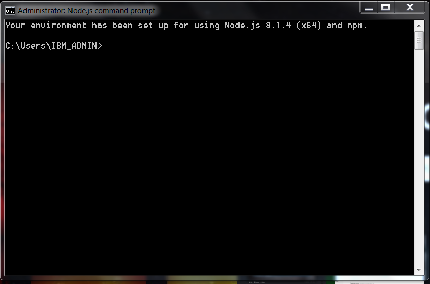
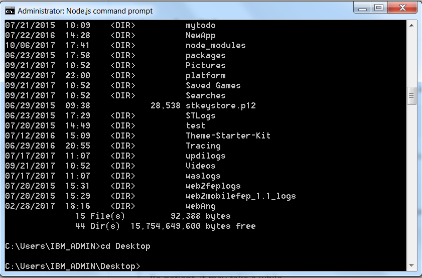

<p align="center">
    <h1 align="center">Install Node, Angular CLI</h1>
</p>

## Node 

[NodeJS](https://nodejs.org/en/download/) - Download and install.

## Angular CLI

### Instalation

Open a terminal window (you can write node in window search and open NodeJs Command Prompt).



```bash
npm install -g @angular/cli
```

> The command above installs Angular CLI on your device (-g is a global install flag) using npm (Node Package Manager)

### Start development

Navigate to the desired location for the application using the command terminal.

Example (I will set up de application on my Desktop)



```bash
ng new awj-app
```

> Be patient, it may take a while.

```bash
cd awj-app
ng serve --open
```

> The `ng serve` command launches the server, watches your files, and rebuilds the app as you make changes to those files. Using the --open (or just -o) option will automatically open your browser on http://localhost:4200/.

> A complete list of commands can be found in `awj-app` folder in README.md file.  

## Visual Studio Code

I recommmend this text editor, you can download it from [here](https://code.visualstudio.com/).
